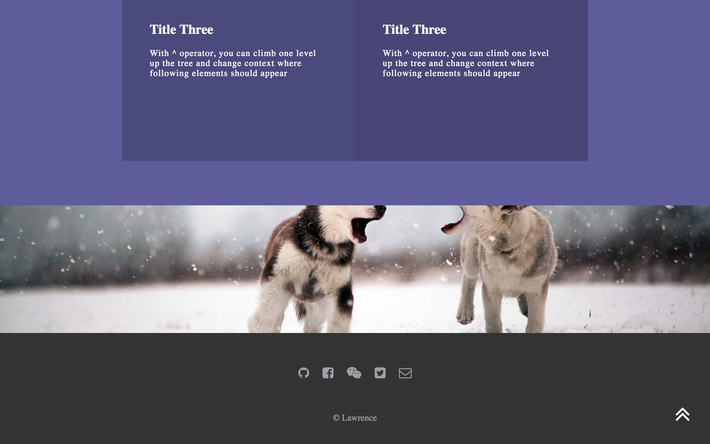
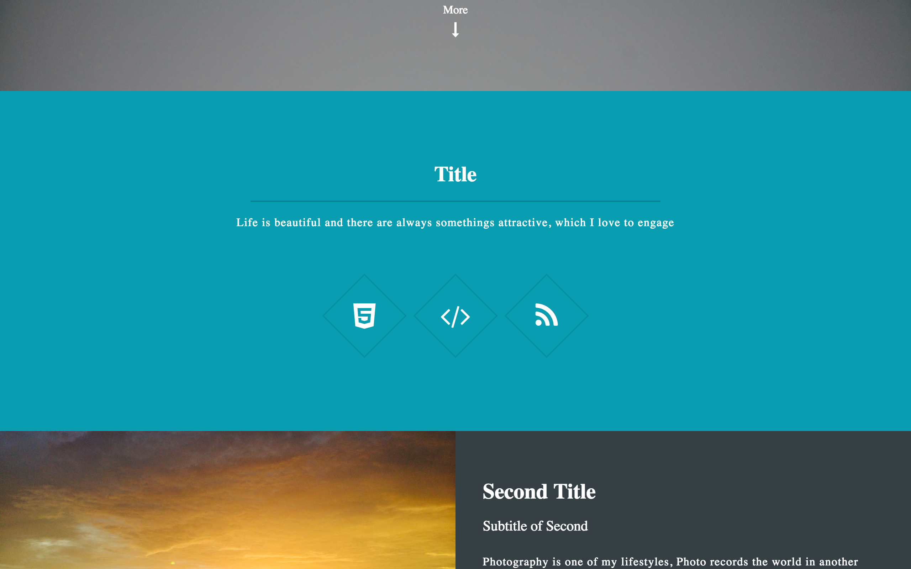
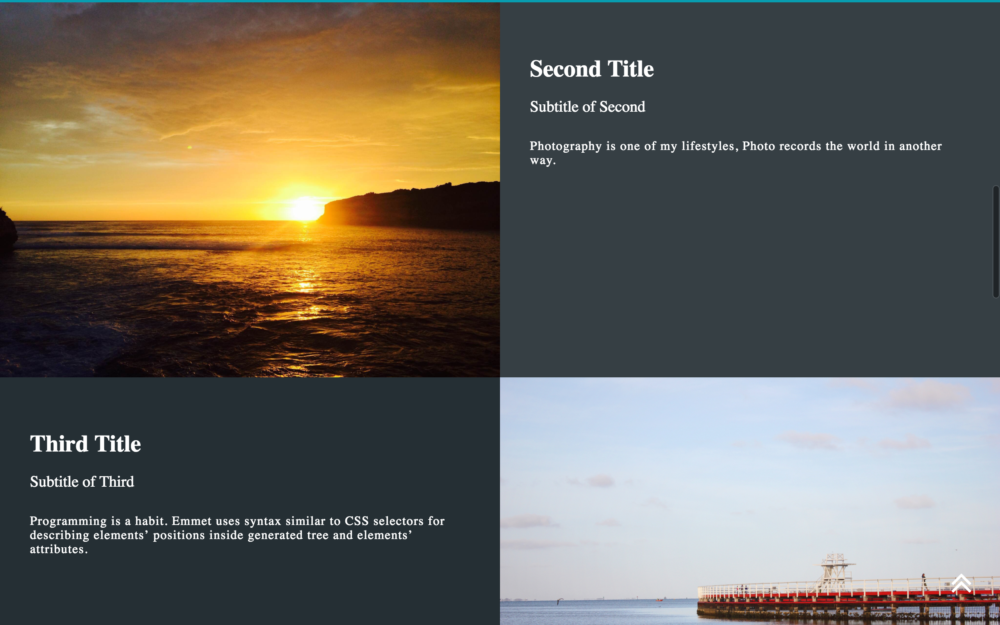

# Personal-Blog
**The Website** develop functions such as

    •Personal projects demo
    •Technological blog updating
    •Personal experience and information display
    •Social media interaction
    •Contact me by website Email function
    
**Features**  

    •javascript in this application uses JQuery library and ES6
    •responsive design
    •all the UI and animations in this application are built by myself (I want to demonstrate the comprehensive competency of website UI design)

# Screenshots of The Website
#### • `Website screen 1` 

#### • `Website screen 2` 

#### • `Website screen 3` 

#### • `Website screen 4` 

# License
   Copyright {2017} {Liangchen Zhou}
   
   Licensed under the Apache License, Version 2.0 (the "License");
   you may not use this file except in compliance with the License.
   You may obtain a copy of the License at
   
       http://www.apache.org/licenses/LICENSE-2.0
       
   Unless required by applicable law or agreed to in writing, software
   distributed under the License is distributed on an "AS IS" BASIS,
   WITHOUT WARRANTIES OR CONDITIONS OF ANY KIND, either express or implied.
   See the License for the specific language governing permissions and
   limitations under the License.
